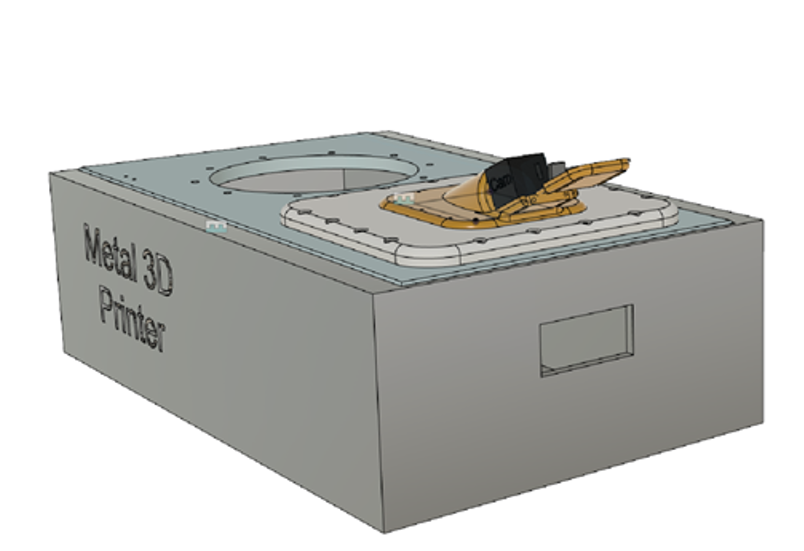

# In-situ-monitoring-of-Powder-bed-fusion-additive-manufacturing
Hardware and software designs for in situ systems for laser-based powder bed fusion additive manufacturing.

   
The CAD model of in situ systems for laser-based powder bed fusion additive manufacturing. 

   
The Camera setup of in situ systems for laser-based powder bed fusion additive manufacturing.  

## [System Design](system_design)
The system (hardware and software) design for the project.

## Licensing and Citation

This work is licensed under a Creative Commons Attribution-ShareAlike 4.0 International License [cc-by-sa 4.0].

Cite this data as: 

Mohamed Abdelwahab, Matthew Burnett, Antonio Fonce, Joud Satme Austin R.J. Downey, and Daniel
Gibson. In-situ-water-quality-sensor, August 2023. URL: https://github.com/ARTSLaboratory/In-Situ-Water-Quality-Sensor

#### Bibtex

@Misc{AbdelwahabSituWaterQuality,  
  author = {Mohamed Abdelwahab and Matthew Burnett and Antonio Fonce and Joud Satme and Austin {R.J.} Downey},  
  title  = {In-Situ-Water-Quality-Sensor},  
  groups = {High-Rate-SHM-Working-Group},  
  url    = {https://github.com/ARTS-Laboratory/In-Situ-Water-Quality-Sensor},  
}  

